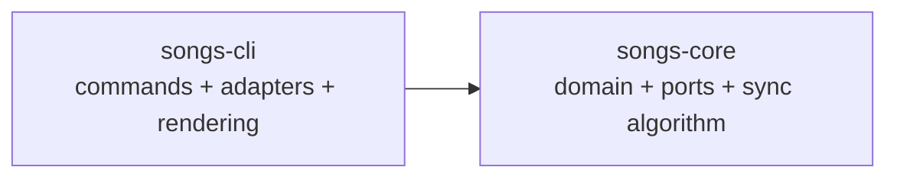
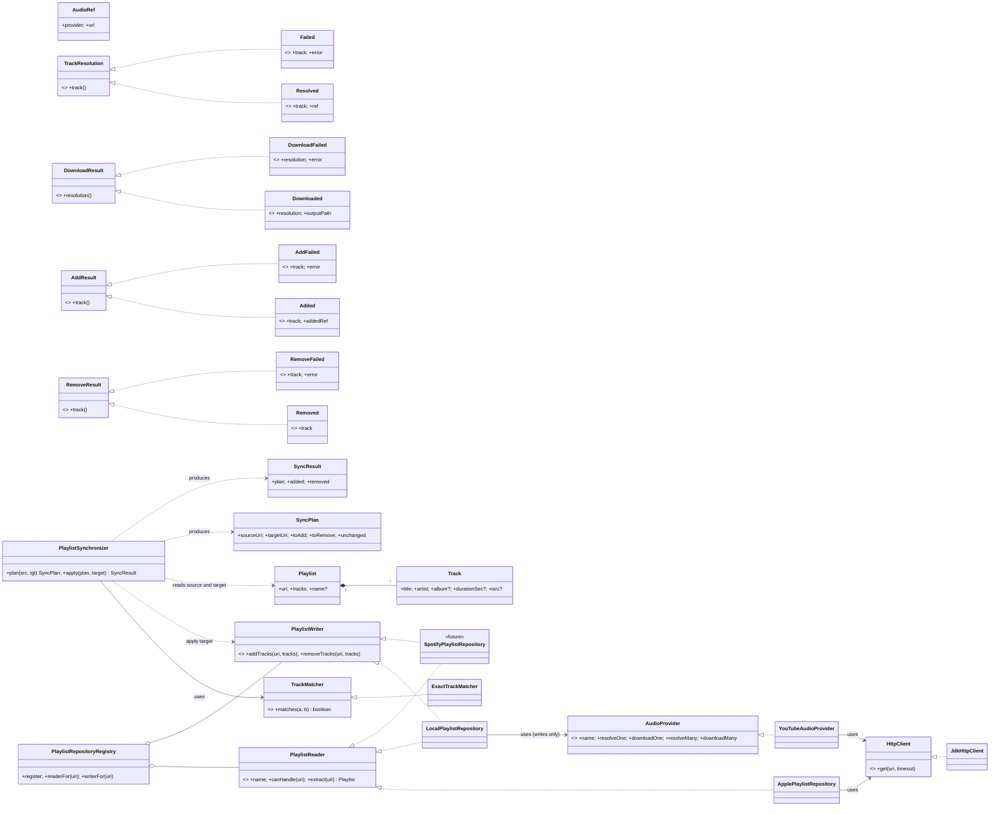

# songs — design & roadmap

Status: **in progress.** Core library and CLI are working; the module split is
complete and distribution is not started.

Scope: a core Java library, plus a thin CLI on top of it. No app, web server,
or DAG integration yet. Those can be added later without changing the core
synchronization algorithm.

This document has two parts:

- **Part 1 — Design.** What the system is and why. Stable reference material.
- **Part 2 — Roadmap.** What is done and what is left, as epics and tasks.

---

# Part 1 — Design

## Invariants

Design invariants:

1. Domain types are source-agnostic. `Track` has no service field.
2. `Playlist.uri` is the sole provenance carrier (Apple URL, `file://…`, etc.).
3. Two orthogonal ports:
   - `PlaylistRepository` — read/write split (`PlaylistReader` + `PlaylistWriter`).
   - `AudioProvider` — where audio bytes come from (YouTube, later others).
4. ISP: read-only backends do not implement `PlaylistWriter`. The sync
   target parameter is typed `PlaylistWriter` — the compiler enforces this.
5. Only two effect boundaries in the whole library: audio download; playlist write.
6. All fan-out returns are input-aligned and failure-carrying (sealed variants).
7. `plan(source, target)` is pure; `apply(plan, target)` is effectful.
8. No static-init side effects (no logging config, no os checks at load time).

## Language / build baseline

- **Java 21** (LTS). Uses `record`, `sealed` interfaces, virtual threads.
- **Maven** — a small multi-module build with strong IDE support.
- Package root remains `com.songs`; modules provide separation without forcing
  a package rename.

## Core / CLI split

Status: **implemented** (see Epic 5).

Use one repository and one Maven reactor with two modules. Separate
repositories would add versioning and release overhead before the boundaries
are stable.

```text
songs/
  pom.xml                  # parent, packaging=pom
  songs-core/
    pom.xml
    src/main/java/com/songs/
  songs-cli/
    pom.xml
    src/main/java/com/songs/
  docs/
```

### Dependency direction



The dependency direction is one-way:

- `songs-core` has no dependency on Picocli, Playwright, yt-dlp, Logback,
  Homebrew, terminal output, or CLI classes.
- `songs-cli` depends on `songs-core` and owns the current external adapters:
  Apple Music, local files, YouTube, HTTP, environment checks, and CLI UX.
- No app module is created yet. A future app can depend on `songs-core` and
  add its own adapters without becoming a dependency of the core.

Keeping adapters in `songs-cli` for now is deliberate: the first goal is to
prove the core/serving boundary, not to create a third module prematurely.
They can move to `songs-adapters` later without changing the core API.

### Core module contents

Move these packages into `songs-core`:

```text
com.songs.model       # Track, Playlist, plans, results
com.songs.matching    # TrackMatcher, ExactTrackMatcher
com.songs.sync        # PlaylistSynchronizer
com.songs.repository  # PlaylistReader, PlaylistWriter ports only
com.songs.provider    # AudioProvider port only
com.songs.concurrency # shared fan-out utility
```

The core owns decisions and structured results. It never prints or chooses a
terminal format. `plan` remains pure; `apply` remains the effectful operation
through the `PlaylistWriter` port.

### CLI module contents

Move the current serving and integration code into `songs-cli`:

```text
com.songs.cli                 # SongsCommand and subcommands
com.songs.cli.render           # terminal presentation
com.songs.repository.apple    # Apple Music adapter
com.songs.repository.local    # local filesystem adapter + tags
com.songs.provider.youtube     # yt-dlp adapter
com.songs.http                 # JDK HTTP adapter
com.songs.env                  # external-tool checks
```

The CLI constructs the adapters, selects repositories, invokes core
operations, renders results, and maps outcomes to process exit codes.

### Maven shape

The root POM becomes an aggregator:

```xml
<packaging>pom</packaging>
<modules>
  <module>songs-core</module>
  <module>songs-cli</module>
</modules>
```

The module dependencies are:

```text
songs-core  -> JDK + core runtime dependencies only
songs-cli   -> songs-core + Picocli + adapters + runtime dependencies
```

The shaded executable is produced by `songs-cli`, not by `songs-core`.
The core module should be testable with fakes and should not need yt-dlp,
Playwright, ffmpeg, or a network connection.

### Shared use-case boundary

Before adding another serving layer, extract the repeated workflow from
`SyncCommand` into a core-facing application service, for example
`SyncPlaylistUseCase`:

```java
SyncPlan preview(
    PlaylistReader sourceReader, String sourceUri,
    PlaylistReader targetReader, String targetUri
);

SyncResult execute(
    PlaylistReader sourceReader, String sourceUri,
    PlaylistReader targetReader, String targetUri,
    PlaylistWriter targetWriter
);
```

The service coordinates extraction, planning, and applying. It returns
structured domain results; `SyncCommand` remains responsible for text and
exit codes. This gives a future app a reusable workflow without importing
CLI classes.

## Simpler choices (locked)

- **Nullable fields in records** (not `Optional<T>`). Idiomatic; matches JDK style.
- **`TrackMatcher.matches(a, b) -> boolean`** (not a key/hash strategy).
  O(n·m) is fine for playlists in the hundreds.
- **Plain virtual-thread executor** for fan-out. No preview APIs.

## Domain (immutable records)

```java
public record Track(
    String title,
    String artist,
    String album,        // nullable
    Integer durationSec, // nullable
    String isrc          // nullable — industry-standard cross-service identifier
) {}

public record Playlist(String uri, List<Track> tracks, String name) {
    public Playlist {
        tracks = List.copyOf(tracks);  // defensive copy → immutable
    }
}

public record AudioRef(String provider, String url) {}
```

## Result types (sealed = closed set of implementations)

A `sealed` interface lists all allowed subclasses. It lets you write an
exhaustive `switch` — the compiler complains if you forget a case.

```java
public sealed interface TrackResolution permits Resolved, Failed {
    Track track();
    record Resolved(Track track, AudioRef ref) implements TrackResolution {}
    record Failed  (Track track, String error) implements TrackResolution {}
}

public sealed interface DownloadResult permits Downloaded, DownloadFailed {
    TrackResolution resolution();
    record Downloaded    (TrackResolution resolution, Path outputPath) implements DownloadResult {}
    record DownloadFailed(TrackResolution resolution, String error)    implements DownloadResult {}
}

public sealed interface AddResult permits Added, AddFailed {
    Track track();
    record Added    (Track track, String addedRef) implements AddResult {}  // e.g. a file path
    record AddFailed(Track track, String error)    implements AddResult {}
}

public sealed interface RemoveResult permits Removed, RemoveFailed {
    Track track();
    record Removed      (Track track)               implements RemoveResult {}
    record RemoveFailed (Track track, String error) implements RemoveResult {}
}

public record SyncPlan(
    String sourceUri, String targetUri,
    List<Track> toAdd, List<Track> toRemove, List<Track> unchanged
) {
    public SyncPlan {
        toAdd = List.copyOf(toAdd);
        toRemove = List.copyOf(toRemove);
        unchanged = List.copyOf(unchanged);
    }
}

public record SyncResult(SyncPlan plan, List<AddResult> added, List<RemoveResult> removed) {
    public SyncResult {
        added = List.copyOf(added);
        removed = List.copyOf(removed);
    }
}
```

## Ports (interfaces)

```java
public interface HttpClient {
    String get(String uri, Duration timeout) throws IOException;

    // Default throws UnsupportedOperationException so read-only callers don't have to implement it.
    default String post(String uri, String jsonBody, Duration timeout) throws IOException {
        throw new UnsupportedOperationException("POST not supported");
    }
}

public interface TrackMatcher {
    boolean matches(Track a, Track b);
}

public interface PlaylistReader {
    String name();
    boolean canHandle(String uri);
    Playlist extract(String uri) throws IOException;
}

public interface PlaylistWriter {
    List<AddResult>    addTracks   (String uri, List<Track> tracks);
    List<RemoveResult> removeTracks(String uri, List<Track> tracks);
}

public interface AudioProvider {
    String name();
    TrackResolution resolveOne (Track track);
    DownloadResult  downloadOne(TrackResolution resolution, Path outputDir);

    // default methods share fan-out logic; concrete providers override only if needed
    default List<TrackResolution> resolveMany(List<Track> tracks, int concurrency) {
        return Concurrency.parallelMap(tracks, this::resolveOne, concurrency);
    }
    default List<DownloadResult> downloadMany(
        List<TrackResolution> resolutions, Path outputDir, int concurrency
    ) {
        return Concurrency.parallelMap(
            resolutions, r -> downloadOne(r, outputDir), concurrency
        );
    }
}
```

A concrete class may implement `PlaylistReader`, `PlaylistWriter`, or both.

## Sync orchestrator

```java
public final class PlaylistSynchronizer {
    private final TrackMatcher matcher;

    public PlaylistSynchronizer(TrackMatcher matcher) { this.matcher = matcher; }
    public PlaylistSynchronizer()                     { this(new ExactTrackMatcher()); }

    /** Pure. No I/O. */
    public SyncPlan plan(Playlist source, Playlist target) { … }

    /** Effectful. Compile-time write-safety: target must be a PlaylistWriter. */
    public SyncResult apply(SyncPlan plan, PlaylistWriter target) { … }
}
```

## Adapters

- `JdkHttpClient implements HttpClient` — wraps `java.net.http.HttpClient`.
  Timeouts always set.
- `ApplePlaylistRepository(HttpClient) implements PlaylistReader` — read-only.
  `canHandle` matches `music.apple.com/**/playlist/**`. Uses **Playwright** to
  capture the client-side Bearer token (see `AppleMusicTokenProvider`), then
  calls Apple's Catalog API (`amp-api.music.apple.com`) via `HttpClient` and
  parses JSON with **Jackson** (see `ApplePlaylistPaginator`). Fetch and parse
  are split so parsing is unit-testable without network.
- `LocalPlaylistRepository(AudioProvider, TagReader) implements PlaylistReader, PlaylistWriter`.
  `canHandle` matches `file://`. Reads tracks from a directory via ID3 tags
  (**jaudiotagger**), with filename fallback (`"Artist - Title.mp3"`).
  `addTracks` calls `AudioProvider.resolveMany` + `downloadMany`, then writes
  ID3 tags per successful download; tag-write failures become `AddFailed`.
  `removeTracks` matches on-disk files against targets via `TrackMatcher`
  (defaults to `ExactTrackMatcher`) and `Files.delete`s the match; each
  removal claims at most one file so duplicate targets don't double-delete.
  An overloaded constructor accepts a custom `TrackMatcher` and concurrency
  bound; the default is `ExactTrackMatcher` and 4.
- `YouTubeAudioProvider(HttpClient, YtDlpConfig) implements AudioProvider`.
  Search uses `HttpClient` + regex over the results page. Download shells out
  to the `yt-dlp` binary via `ProcessBuilder` (no reliable Java-native yt-dlp).
  The interface hides the subprocess.
- `ExactTrackMatcher implements TrackMatcher` — matches on ISRC if both sides
  have it, else on normalized `(title, artist)` (lowercase, strip punctuation,
  collapse whitespace).

Not in this PR (interfaces ready, adapters not written):
`SpotifyPlaylistRepository`, `TidalPlaylistRepository`, `SoundCloudAudioProvider`.

## Registry

```java
public final class PlaylistRepositoryRegistry {
    public void register(Object repo);              // reader, writer, or both
    public PlaylistReader readerFor(String uri);    // first canHandle match
    public PlaylistWriter writerFor(String uri);    // throws if matched repo is read-only
}
```

The current writer port has no `canHandle` method by design, so a URI-dispatched
writer must also implement `PlaylistReader`; its reader capability supplies the
URI match. `readerFor` and `writerFor` use first-match registration order, and
`writerFor` rejects a matching read-only repository. If callers always
instantiate a specific repository directly, they can ignore this.

## Support

- `Concurrency.parallelMap(List<T> items, Function<T,R> fn, int concurrency)`
  — order-preserving. Uses `Executors.newVirtualThreadPerTaskExecutor()`
  internally so `concurrency` bounds concurrent network calls, not OS threads.
- `Env.isFfmpegAvailable() : boolean` and `Env.requireFfmpeg()`.
- `Env.isJsRuntimeAvailable() : boolean` — checks for `deno` / `node` on PATH
  (required by current yt-dlp for YouTube extraction).
- Logging: **SLF4J API + Logback**. Loggers per class via
  `LoggerFactory.getLogger(getClass())`. Library code uses `info` for operation
  boundaries and summaries, `debug` for detailed progress, and `warn` for
  recoverable failures or missing external tools. No global setup in library
  code; the test suite uses `src/test/resources/logback.xml`, while a consumer
  application supplies its own configuration.

## Class diagram



## Project layout (before module split)

```
pom.xml
src/
  main/java/com/songs/
    model/
      Track.java  Playlist.java  AudioRef.java
      TrackResolution.java  DownloadResult.java
      AddResult.java  RemoveResult.java
      SyncPlan.java  SyncResult.java
    http/
      HttpClient.java  JdkHttpClient.java
    matching/
      TrackMatcher.java  ExactTrackMatcher.java
    repository/
      PlaylistReader.java  PlaylistWriter.java  PlaylistRepositoryRegistry.java
      apple/ApplePlaylistRepository.java
      local/LocalPlaylistRepository.java  TagReader.java
    provider/
      AudioProvider.java
      youtube/YouTubeAudioProvider.java  YtDlpConfig.java
    sync/
      PlaylistSynchronizer.java
    concurrency/
      Concurrency.java
    env/
      Env.java
  test/java/com/songs/…
```

## Project layout (current)

```text
pom.xml                         # parent aggregator
songs-core/
  pom.xml
  src/main/java/com/songs/      # domain, ports, matching, sync, concurrency
  src/test/java/com/songs/
songs-cli/
  pom.xml
  src/main/java/com/songs/      # CLI, adapters, external integrations
  src/main/resources/           # runtime logging
  src/test/java/com/songs/
  src/test/resources/           # adapter fixtures and test logging
```

## Dependencies

| Purpose | Library |
|---|---|
| Apple token capture (headless browser) | Playwright for Java |
| JSON parsing | Jackson (`jackson-databind`) |
| ID3 tags | jaudiotagger |
| Logging API | SLF4J + Logback |
| Tests | JUnit 5 |

External binaries required at runtime: `ffmpeg`, `yt-dlp`, and a JS runtime
(`deno` or `node`) for YouTube extraction. `Env` predicates surface these.

## CLI

Status: **implemented** (see Epic 4).

A thin front-end over the library. The library stays CLI-agnostic: nothing in
`com.songs.cli` is referenced by any other package, and `System.out` appears
nowhere outside it.

### Design rules

1. **`sync` means sync.** The target is made to match the source: missing
   tracks are added, extra tracks are removed. No `--delete` flag — a
   half-sync is not a thing.
2. **`--dry-run` is the safety mechanism.** It prints the plan and exits
   without touching the target.
3. POSIX/GNU option syntax (`-v`, `--verbose`, `--`), via picocli.
4. Data on stdout, logs and progress on stderr, so output can be piped.
5. Exit codes are meaningful; scripts can branch on them.

### Commands

```
songs sync <SOURCE_URI> <TARGET_URI>   # make target match source
songs show <URI>                       # print the tracks at a URI
songs doctor                           # check ffmpeg / yt-dlp / JS runtime
```

`sync` is the whole point of the tool. It extracts both sides through
`PlaylistRepositoryRegistry`, calls `PlaylistSynchronizer.plan`, then
`apply`. Source duplicates are collapsed by `plan`, so each distinct track
is downloaded once.

`show` is read-only inspection — useful for verifying extraction and ID3
reading before syncing.

`doctor` wraps the `Env` predicates and reports what's missing. It replaces
the ad-hoc `main` currently sitting in `Env`.

### Flags

| Flag | Applies to | Purpose |
|---|---|---|
| `--dry-run` | `sync` | Print the plan, change nothing |
| `--concurrency <n>` | `sync` | Bound parallel resolve/download |
| `-v`, `--verbose` | all | Repeatable; raises the Logback level |
| `-q`, `--quiet` | all | Errors only |
| `-h`, `--help` | all | picocli-generated, per subcommand |
| `-V`, `--version` | root | Version from the jar manifest |

### Exit codes

```
0  success
1  runtime error (including missing external tooling)
2  usage error (picocli default)
3  partial failure — some tracks failed to add or remove
```

Code 3 matters: a sync where 4 of 364 tracks fail is neither success nor
total failure.

### Package layout

```
src/main/java/com/songs/cli/
  SongsCommand.java     # root command, global options, wires subcommands
  SyncCommand.java
  ShowCommand.java
  DoctorCommand.java
  Renderer.java         # plan + result formatting (not model toString)
```

Model `toString` implementations stay debug-oriented; the CLI owns
presentation.

### Build changes

- Add **picocli** (`info.picocli:picocli`, 4.7.x).
- Move **logback-classic** from `test` to runtime scope — a CLI needs a
  logging binding at runtime.
- Add **maven-shade-plugin** to produce a runnable jar with
  `Main-Class: com.songs.cli.SongsCommand`, plus a `songs` wrapper script.

## Distribution — minimal Homebrew installation

Status: **planned** (see Epic 6).

Start with a personal tap rather than Homebrew Core. This gives a simple
release path while the CLI and its external requirements are still evolving.

### Release artifact

Each tagged release builds one executable shaded artifact:

```text
songs-cli/target/songs.jar
```

Publish it to a GitHub Release with a stable version such as `0.1.0` and a
SHA-256 checksum. Do not publish `SNAPSHOT` builds to the tap.

### Minimal formula

Create a separate repository named `homebrew-songs` with
`Formula/songs.rb`:

```ruby
class Songs < Formula
  desc "Synchronize music playlists"
  homepage "https://github.com/OWNER/songs"
  url "https://github.com/OWNER/songs/releases/download/v0.1.0/songs.jar"
  sha256 "RELEASE_SHA256"
  version "0.1.0"

  depends_on "openjdk@21"

  def install
    libexec.install "songs.jar"
    bin.write_jar_script libexec/"songs.jar", "songs", java_version: "21"
  end

  test do
    assert_match "Synchronize music playlists", shell_output("#{bin}/songs --help")
  end
end
```

The first formula should install only Java as a required Homebrew dependency.
`yt-dlp`, `ffmpeg`, the JavaScript runtime, and the Playwright browser need
explicit validation and platform testing before being made automatic formula
dependencies. `songs doctor` must report actionable install instructions for
anything missing.

### User experience

```bash
brew tap OWNER/songs
brew install songs
songs doctor
songs sync --dry-run SOURCE_URI TARGET_URI
songs sync SOURCE_URI TARGET_URI
```

The user does not need Maven, a JDK setup, a repository checkout, or a
versioned jar filename. Homebrew owns the executable wrapper and Java path.

## Explicitly out of scope

- Web server / HTTP front-end. Add later.
- CLI beyond the three commands above (no `completion`, no config file,
  no JSON output, no named profiles in v1).
- Spotify / Tidal / SoundCloud implementations (interfaces ready, not written).
- Fuzzy track matching (interface ready via `TrackMatcher`; only `ExactTrackMatcher` shipped).
- Retries / backoff.
- Caching of resolutions.
- M3U / PLS playlist file formats for local (directory-of-files only).
- Native yt-dlp equivalent (subprocess is the strategy).

---

# Part 2 — Roadmap

Legend: `[x]` done · `[ ]` not started.

| Epic | Theme | Status |
|---|---|---|
| 1 | Core domain & algorithm | Done |
| 2 | Adapters | Done |
| 3 | Sync orchestration | Done |
| 4 | CLI | Done |
| 5 | Core / CLI module split | Done |
| 6 | Distribution (Homebrew) | Private repo baseline done |

## Epic 1 — Core domain & algorithm

**Goal:** immutable domain types, sealed results, and pure matching logic.
**Status: done.**

- [x] Toolchain: JDK 21 + Maven, `pom.xml` targeting Java 21.
- [x] Dependencies + JUnit 5 wired; `mvn test` green.
- [x] Domain records: `Track`, `Playlist`, `AudioRef` with defensive copies.
- [x] Sealed `TrackResolution` with `Resolved` / `Failed`.
- [x] Sealed `DownloadResult`, `AddResult`, `RemoveResult`.
- [x] `SyncPlan` and `SyncResult` records.
- [x] Port interfaces: `HttpClient`, `TrackMatcher`, `PlaylistReader`, `PlaylistWriter`.
- [x] `ExactTrackMatcher`: ISRC first, else normalized title + artist.
- [x] `Concurrency.parallelMap`: order-preserving, virtual threads, bounded.
- [x] `AudioProvider` default `resolveMany` / `downloadMany`.

## Epic 2 — Adapters

**Goal:** talk to the outside world behind the core ports.
**Status: done.**

- [x] `JdkHttpClient` with mandatory timeouts.
- [x] `AppleMusicTokenProvider`: Playwright bearer-token capture.
- [x] `ApplePlaylistPaginator`: catalog API paging, Jackson parsing, fixture-tested.
- [x] `ApplePlaylistRepository` (read-only).
- [x] `TagReader`: read and write ID3 tags via jaudiotagger.
- [x] `LocalPlaylistRepository.extract` with filename fallback.
- [x] `LocalPlaylistRepository.addTracks` / `removeTracks`, aligned results.
- [x] `YouTubeAudioProvider.resolveOne` (InnerTube search).
- [x] `YouTubeAudioProvider.downloadOne` (yt-dlp subprocess).
- [x] `Env` checks for ffmpeg and a JS runtime.

## Epic 3 — Sync orchestration

**Goal:** a pure plan and an effectful apply.
**Status: done.**

- [x] `PlaylistSynchronizer.plan` — pure diff, greedy one-to-one claiming.
- [x] `PlaylistSynchronizer.apply` — delegates to `PlaylistWriter`.
- [x] `PlaylistRepositoryRegistry` — URI dispatch, read-only rejection.
- [x] Logging pass: SLF4J per class, `logback.xml` for tests.
- [x] Set semantics: source duplicates collapsed before matching.

## Epic 4 — CLI

**Goal:** a usable terminal front-end that a non-Java user can run.
**Status: done.**

- [x] Picocli wired; `songs --help` and `--version`.
- [x] `doctor` — ffmpeg / yt-dlp / JS runtime checklist, exit 1 when missing.
- [x] `RepositoryFactory` — builds the registry, replaces Playground hardcoding.
- [x] `show <URI>` — dispatch, extraction, rendering.
- [x] `sync --dry-run` — plan rendering, no side effects.
- [x] `sync` — full apply, failure summary, exit 3 on partial failure.
- [x] `--concurrency` flag.
- [x] Runtime `logback.xml` sending logs to stderr, data to stdout.
- [x] Shaded `target/songs.jar` with `Main-Class`.
- [x] `bin/songs` launcher that resolves through symlinks.
- [x] `-v` / `-q` mapped to Logback levels programmatically.
- [x] CLI tests asserting help, version, usage errors, concurrency validation,
      and dry-run output.
- [x] Delete the ad-hoc `main` in `Env` (superseded by `doctor`).

### Known defects (found in a real 364-track sync; fixed)

- [x] `canonicalPath` sanitizes path separators and other unsafe characters.
- [x] yt-dlp's default temporary output template uses `%(id)s.%(ext)s`,
  preventing collisions between concurrent downloads with the same title.

## Epic 5 — Core / CLI module split

**Goal:** make the serving layer replaceable without touching the algorithm.
**Status: done.** Design: "Core / CLI split" above.

- [x] Root POM is `packaging=pom` with `songs-core` and `songs-cli` modules.
- [x] Model, matching, sync, ports, and concurrency moved into `songs-core`.
- [x] CLI, adapters, HTTP, and env moved into `songs-cli`.
- [x] `songs-core` tests run without network, browser, or subprocess dependencies.
- [x] `songs-cli` tests use Picocli command execution and local fixtures.
- [x] `SyncPlaylistUseCase` extracted; sync and dry-run share it.
- [x] Only `songs-cli` produces the shaded executable; core is a library jar.
- [x] `bin/songs` points at `songs-cli/target/songs.jar`.

## Epic 6 — Distribution (Homebrew)

**Goal:** `brew install` then `songs`, with no Java knowledge required.
**Status: private repository baseline done; Homebrew not started.** Design:
"Distribution" above.

- [x] Initialize a private GitHub repository at `durczokj/songs`.
- [x] Add `.gitignore` rules excluding audio, local playlist data, build
  output, credentials, and browser caches.
- [x] Verify the initial commit contains no audio files or `data/` paths.
- [ ] Switch from `0.1.0-SNAPSHOT` to tagged release versions.
- [ ] GitHub Actions builds the CLI jar and publishes it to a Release.
- [ ] Publish the SHA-256 checksum alongside the jar.
- [ ] Create the `homebrew-songs` tap with `Formula/songs.rb`.
- [ ] Formula depends on `openjdk@21` and uses `bin.write_jar_script`.
- [ ] Formula `test do` block asserts `songs --help`.
- [ ] Verify `brew install` on Apple Silicon and Intel macOS.
- [ ] Decide whether ffmpeg / yt-dlp / JS runtime / Playwright browser become
      formula dependencies or stay `doctor`-reported prerequisites.

